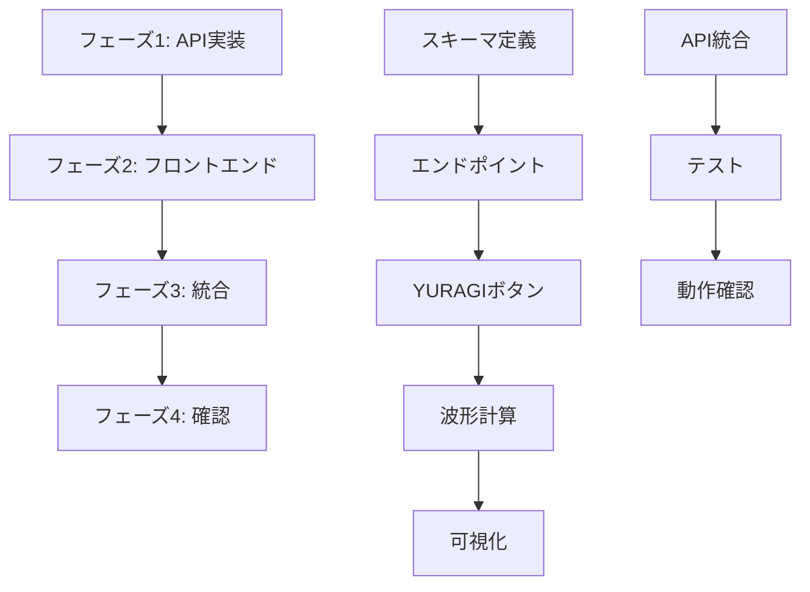

# マッサージ機能実装計画書（シンプル版）

## 概要

本計画書は、ゆらぎ付き円運動系の力覚ベクトル（YURAGI機能）を最小限の実装で実現するための開発計画を定義します。WebSocketを使用せず、シンプルなREST APIベースの実装とします。

## 実装アーキテクチャ

### バックエンドアーキテクチャ
- **REST API**: FastAPIエンドポイントでプリセット起動
- **最小限の実装**: YURAGIボタン押下時にプリセットパラメータを適用
- **物理モデリング**: 円運動、1/fノイズ、振幅変調、機械共振（180Hz, ζ≈0.08）

### フロントエンドアーキテクチャ
- **独立した波形計算**: バックエンドと同じアルゴリズムをフロントエンドで実装
- **可視化**: Canvasによる波形とXY軌跡の描画
- **YURAGIボタン**: プリセット起動のトリガー
- **状態管理**: 既存のZustandストアを拡張

## フェーズ別実装計画

### フェーズ1: 最小限のAPI実装 - 1日

#### タスク1.1: YURAGIプリセットスキーマ
**ファイル修正**:
```
backend/src/api/schemas.py (既存ファイルに追加)
```

**実装内容**:
```python
# schemas.py に追加
class YURAGIPresetRequest(BaseModel):
    device_id: int = Field(..., ge=1, le=2)
    preset: Literal["default", "gentle", "strong", "slow"] = Field("default")
    enabled: bool = Field(True)

class YURAGIStatusResponse(BaseModel):
    enabled: bool
    preset: str
    device_id: int
```

#### タスク1.2: YURAGIエンドポイント実装
**ファイル修正**:
```
backend/src/main.py (既存ファイルに追加)
```

**実装内容**:
```python
@app.post("/api/yuragi/preset")
async def set_yuragi_preset(request: YURAGIPresetRequest) -> YURAGIStatusResponse:
    """YURAGIプリセットを適用"""
    # プリセットに基づいてパラメータを設定
    # 既存のHapticControllerを使用してベクトル制御
    return YURAGIStatusResponse(
        enabled=request.enabled,
        preset=request.preset,
        device_id=request.device_id
    )
```

### フェーズ2: フロントエンド実装 - 2日

#### タスク2.1: YURAGI波形計算モジュール
**ファイル作成**:
```
frontend/src/utils/yuragiWaveform.ts
```

**実装内容**:
- CircularMotionGenerator（TypeScript版）
- AmplitudeModulator（TypeScript版）
- 1/fノイズ生成関数
- プリセットパラメータ定義

#### タスク2.2: YURAGIボタンコンポーネント
**ファイル作成**:
```
frontend/src/components/ControlPanel/YURAGIControl.tsx
```

**実装内容**:
```typescript
// YURAGIボタンとプリセット選択UI
export const YURAGIControl: React.FC = () => {
  const [preset, setPreset] = useState('default')
  const [enabled, setEnabled] = useState(false)
  
  const handleToggle = async () => {
    // APIコール
    // 波形計算開始/停止
  }
}
```

#### タスク2.3: 波形可視化の拡張
**ファイル修正**:
```
frontend/src/components/Visualization/WaveformChart.tsx
frontend/src/components/Visualization/AccelerationTrajectory.tsx
```

**実装内容**:
- YURAGI波形の描画対応
- 円運動軌跡の表示
- プリセット切り替え時のアニメーション

### フェーズ3: 統合とテスト - 1日

#### タスク3.1: バックエンド統合
**実装内容**:
- YURAGIプリセットのパラメータマッピング
- 既存のHapticControllerとの統合
- 円運動パターンの生成ロジック

#### タスク3.2: フロントエンド統合
**実装内容**:
- YURAGIボタンとAPIの接続
- 波形計算の開始/停止制御
- 可視化コンポーネントとの連携

#### タスク3.3: 統合テスト
**テスト内容**:
- YURAGIボタン押下→API呼び出し→波形生成
- プリセット切り替えの動作確認
- 描画パフォーマンス測定

### フェーズ4: 動作確認とドキュメント - 1日

#### タスク4.1: E2Eテスト
**Playwright テスト**:
```typescript
test('YURAGIボタンによるプリセット起動', async ({ page }) => {
  await page.goto('http://localhost:5173')
  await page.click('button:has-text("YURAGI")')
  await page.selectOption('#yuragi-preset', 'gentle')
  await page.click('#yuragi-start')
  await expect(page.locator('#waveform-display')).toBeVisible()
})
```

#### タスク4.2: 動作確認
**確認項目**:
- YURAGIボタンの動作
- プリセット切り替え
- 波形描画の滑らかさ
- エラーハンドリング

#### タスク4.3: ドキュメント更新
**更新対象**:
- APIエンドポイント仕様
- YURAGIボタンの使用方法
- プリセットの説明

## 依存関係グラフ



## リスク管理

### 技術的リスク
1. **フロントエンド波形計算パフォーマンス**
   - 軽減策: requestAnimationFrameでの最適化、計算の間引き
   
2. **数学的複雑性**
   - 軽減策: バックエンドと同じアルゴリズムを移植

### スケジュールリスク
1. **実装のシンプル化**
   - 軽減策: 最小限の機能に絞って実装

## 成功基準

### パフォーマンス基準
- API応答時間: <100ms
- フロントエンド波形計算: <16ms（60fps）
- Canvas描画: >30fps（最小）

### 品質基準
- YURAGIボタンの動作: 100%成功
- プリセット切り替え: エラーなし

### 機能基準
- 円運動パターンの視覚的確認
- プリセット（default, gentle, strong, slow）の動作

## 実装の簡略化

### 実装方針
- WebSocket不要、REST APIのみ
- 最小限のエンドポイント（/api/yuragi/preset）
- フロントエンドで独立して波形計算
- 既存コンポーネントの最大限活用

### 実装工数
- 総工数: 3-4日（大幅に短縮）
- バックエンド: 0.5日
- フロントエンド: 2日
- 統合・テスト: 1日

## 次のステップ

1. YURAGIエンドポイントの実装
2. フロントエンド波形計算モジュールの実装
3. YURAGIボタンUIの実装
4. 統合テストと動作確認
5. PR作成

シンプルな実装により、短期間でYURAGI機能を実現できます。